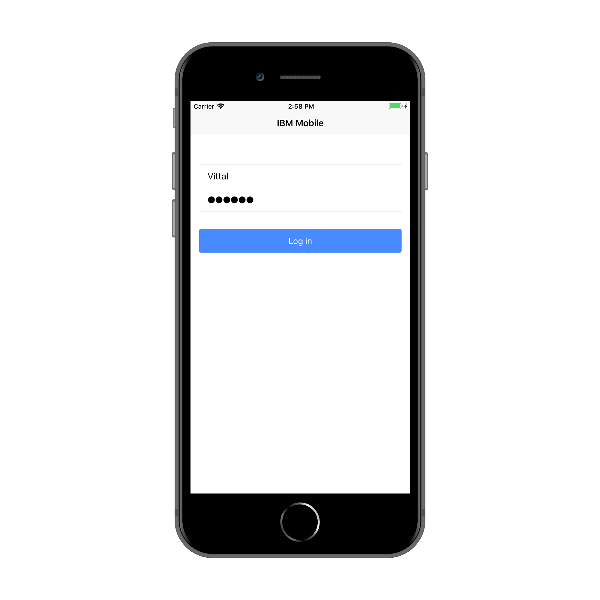
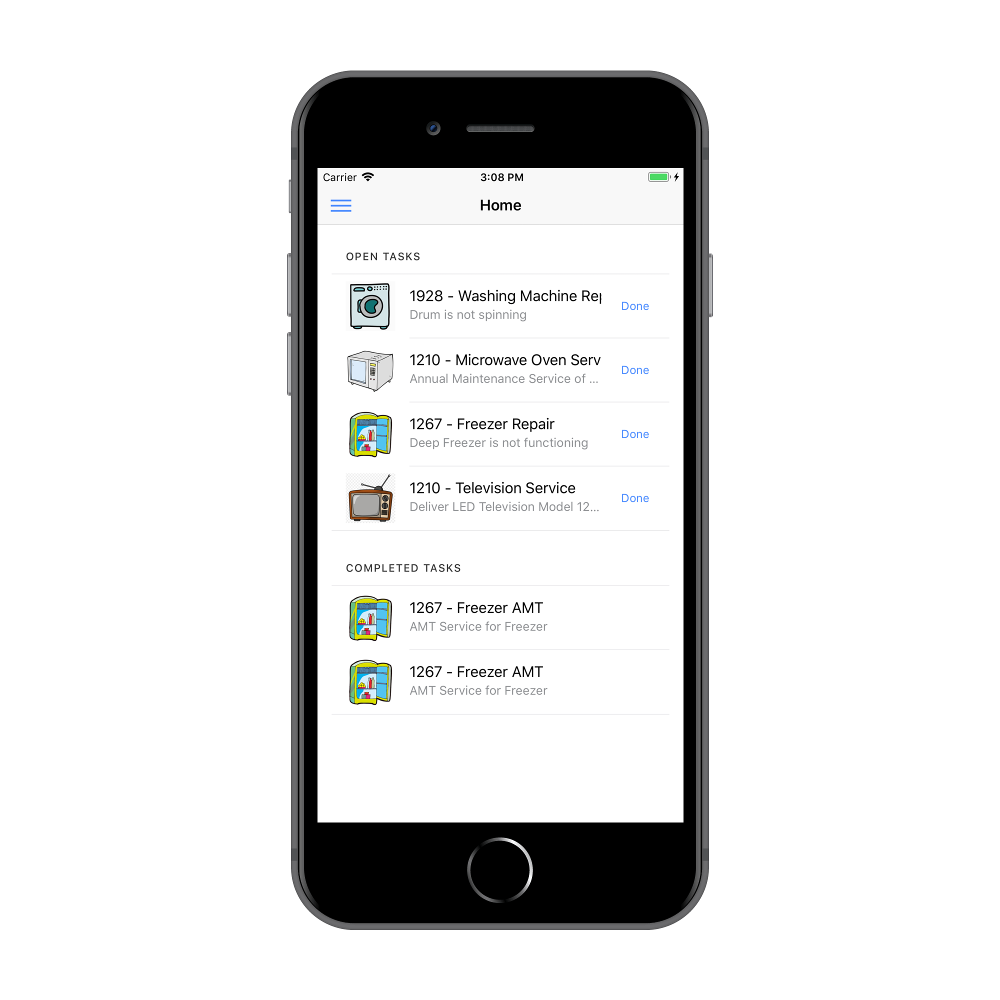

IBM Mobile
===
## Ionic Starter
A sample Ionic application demonstrating use of the Mobile Security, JSONStore Synchronization and Push Notification Capabilities using IBM Mobile Foundation.

  
   

### Usage

1. Use either Maven, MobileFirst CLI or your IDE of choice to [build and deploy the available `UserLogin` and `JSONStoreCloudantSync` adapters](https://mobilefirstplatform.ibmcloud.com/tutorials/en/foundation/8.0/adapters/creating-adapters/).

	The `UserLogin` Security Check adapter and `JSONStoreCloudantSync` Resource adapter can be found inside `adapters` folder.

2. From a command-line window, navigate to the project's root folder and run the commands:
 - `ionic cordova platform add` - to add a platform.
 - `mfpdev app register` - to register the application.
 - `ionic cordova run` - to run the application.

3. Run the application in an Android Emulator, iOS Simulator, Browser or physical device.

### Bugs and Issues

Have a bug or an issue with this application? [Open a new issue](https://github.com/ibmmobile/mf-starter-ionic/issues) here on Github.

### Supported Levels
IBM Mobile Foundation 8.0

### License
Copyright 2018 IBM Corp.

Licensed under the Apache License, Version 2.0 (the "License");
you may not use this file except in compliance with the License.
You may obtain a copy of the License at
att
http://www.apache.org/licenses/LICENSE-2.0

Unless required by applicable law or agreed to in writing, software
distributed under the License is distributed on an "AS IS" BASIS,
WITHOUT WARRANTIES OR CONDITIONS OF ANY KIND, either express or implied.
See the License for the specific language governing permissions and
limitations under the License.
